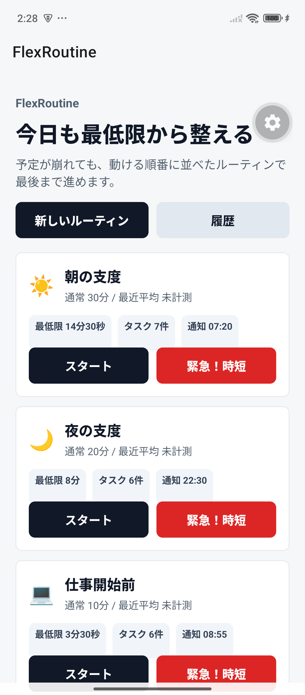
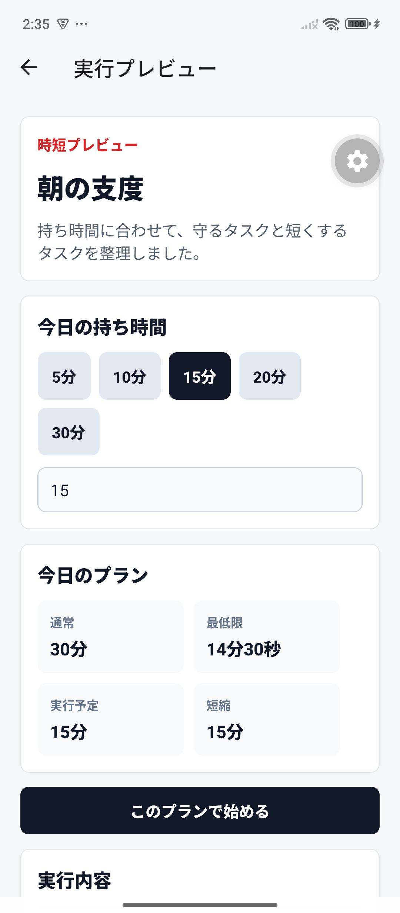
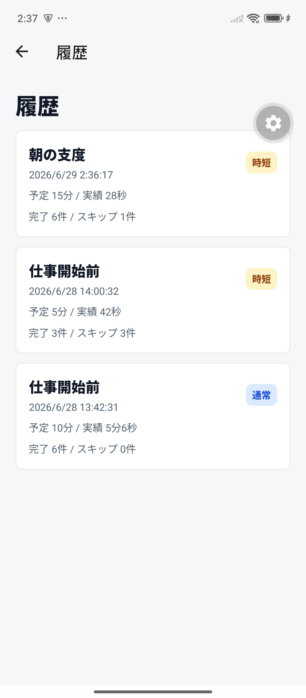

# FlexRoutine

> 予定が崩れても、今日の「最低限」から整え直せるルーチンタイマー。

FlexRoutineは、寝坊・急な予定変更・体調不良などで通常のルーチンを完遂しにくいときに、やるべきことを減らしながら再開を助けるAndroid向けMVPです。単にタイマーを動かすのではなく、**必須の行動は残し、短縮できる行動は縮め、任意の行動は外す**という判断を、緊急・時短モードで見える形にしました。

Google Playの一般公開は現在保留し、Android実機で動く成果物、検証記録、設計判断をポートフォリオとして整備しています。方針の詳細は[配布・公開方針の決定ログ](docs/decisions/distribution-and-release-strategy.md)を参照してください。

## デモ

| ホーム                                                                            | 緊急・時短プラン                                                               | 実行履歴                                                                          |
| --------------------------------------------------------------------------------- | ------------------------------------------------------------------------------ | --------------------------------------------------------------------------------- |
|  |  |  |

さらに、タイマー画面のAndroid safe area対応は[こちらの実機スクリーンショット](docs/blog-assets/device-goal3-timer-safe-area.png)で確認できます。60秒で説明するための操作順は[Androidデモ資料](docs/portfolio/android-demo.md)にまとめています。

## 体験のポイント

- **崩れた日の再設計**: 通常スタートに加え、緊急・時短スタートで最低限の行動だけに絞ったプランを先に見せる。
- **行動の優先度をデータ化**: `MUST_DO`、`SHRINKABLE`、`OPTIONAL` の3種類で、残す・短縮する・外す判断を一貫させる。
- **途中で止まっても戻りやすい操作**: 自動／手動進行、一時停止、スキップ、+30秒、実行結果の保存を用意する。
- **振り返りまでつなげる**: 完了カードのPNG共有、履歴、実行詳細、後からのメモ編集で、次回の改善材料を残せる。
- **実機での見え方を確認**: Androidのステータスバーと重ならないタイマー画面、Expo Goで通知が使えない場合の安全なfallbackを実装している。

## 実装範囲

Goal 1からGoal 4までのMVPを実装済みです。

- Expo Router / TypeScript / ESLint構成
- SQLite DB schemaとmigration v1-v3
- routines / tasks / execution_logs / task_logs / suggestions / app_settings
- サンプルルーティンseed、新規作成テンプレート、タスク追加・編集・並び替え・アーカイブ
- 通常スタート / 緊急・時短スタート、時短プラン生成
- TimerのAUTO/MANUAL進行、一時停止、スキップ、+30秒、完了保存
- 通知設定UI、履歴一覧、実行詳細、後からのメモ編集
- 完了カード、背景テンプレート、タスク概要/メモの表示オプション、PNG共有

## 技術構成

- Expo SDK 56 / React Native / Expo Router
- TypeScript / ESLint
- Expo SQLite
- Expo Haptics / Sharing / Notifications

## 実機QAと検証

Android 15の実機で、ルーチン作成、時短プラン、タイマー、完了保存、共有、履歴、メモ編集までを確認しています。検証項目とスクリーンショット証跡は[Goal 3 Device Checklist](docs/qa/goal-3-device-checklist.md)を参照してください。

2026-07-12時点のポートフォリオ回帰記録は[こちら](docs/qa/portfolio-regression-2026-07-12.md)です。ロック解除後に再実行する実機スモークテストも明示しています。

ローカルで実行できる静的検証:

```powershell
npm.cmd run typecheck
npm.cmd run lint
npm.cmd run verify:routine-totals
npm.cmd run verify:run-plan
npm.cmd run verify:android-env
npm.cmd run verify:db-migrations
```

## ローカル起動

```powershell
npm.cmd install
npm.cmd run start
```

Android実機またはエミュレータで確認する場合:

```powershell
npm.cmd run android
```

## 既知の制約と今後

- Expo GoのAndroidでは、SDK 53以降 `expo-notifications` の実通知が制限されるため、UIと安全なfallbackを確認している。実通知はdevelopment buildで検証する。
- 長時間バックグラウンド復帰、OS kill後の途中再開、通知からの途中復帰は今後の改善対象。
- Web版は、ネイティブ機能との互換性と保守コストを確認できた場合のみ検討する。
- Google Playの一般公開、正式アプリ名、Android package nameは、公開方針を再検討するまで変更しない。

## 資料

- [配布・公開方針の決定ログ](docs/decisions/distribution-and-release-strategy.md)
- [Androidデモ資料](docs/portfolio/android-demo.md)
- [ポートフォリオ回帰QA](docs/qa/portfolio-regression-2026-07-12.md)
- [Goal 1 QA](docs/qa/goal-1-android-checklist.md) / [Goal 2 QA](docs/qa/goal-2-device-checklist.md) / [Goal 3 QA](docs/qa/goal-3-device-checklist.md)
- [Goal 3 設計判断](docs/decisions/goal-3-decisions.md)
- [将来のGoogle Play公開チェックリスト](docs/release/google-play-launch-checklist.md)
